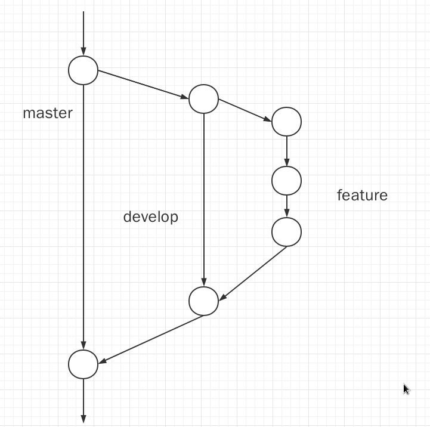

# OB
OB比赛代码仓库

成员：陈祎，潘力菘，王家璇

## 版本管理

### git协同开发

分为三个部分：master，develop，feature



#### master

​	主分支，它用于存放经过测试，已经完全稳定代码，这也是我们提交比赛代码的分支，本次合作中，我们只会提交  **master**  分支的代码。**master**  只应该接受  **develop**  的合并，也就是说，**master**  所有代码更新应该源于合并 **develop**  的代码。

​	log建议： "master old -> master new, from develop-xxx，master old代表旧master版本号，master new加一，develop-xxx/x.x则是合并分支的来源。

#### develop

 	开发分支，一开始从 **master** 分支中分离出来，用于开发者存放基本稳定代码。每个开发者自己的仓库上也有  **master** 和  **develop**  。开发者把功能做好以后，是存放到自己的  **develop**  中，当测试完以后，可以向管理者发起一个PR，请求把自己仓库的develop分支合并到源仓库的develop中。

​	建议命名：自己名字的缩写-develop/版本号    例如：pls-develop/1.0，其中版本号分为两部分：主板本号-次版本号，建议：主版本号跟随master，次版本号每合并一次 **feature** 加一。

​	log建议："develop old->develop new, from develop-xxx/x.x"，含义参考  **master**

#### feature

​	功能性分支，是用于开发项目的功能的分支，是开发者主要战斗阵地。开发者在本地仓库从 **develop** 分支分出功能分支，在该分支上进行功能的开发，开发完成以后再合并到  **!!!自己的!!!**  **develop**  分支上，这时候功能性分支已经完成任务 。

​	建议命名： feature-功能名字  例如：feature-select

#### 开发流程

​	从仓库clone下代码后，使用如下命令生成新的分支：

```shell
git checkout -b develop-xxx
```

​	然后在编写新功能时：

```shell
git checkout -b feature-xxx
```

​	**feature** 分支向 **develop**  分支合并时：

```shell
# 回到develop分支
git checkout develop
# 把做好的功能合并到develop中 
git merge feature-discuss
```

#### 注意事项

 1. 不要不要不要轻易去**merge**主分支 ，合并主分支的时候需大家都在场！！！

 2. 合并develop的时候，如果出现了冲突，要和出现冲突的文件的负责人进行沟通后再进行merge。

 3. merge develop分支和master分支后需要通知全体成员。

 4. 如果想修改最近一次 git log，没必要重新git add，git commit，执行以下命令：

    ```shell
    git commit -amend
    ```

    然后进入vim中进行修改即可。

	5. 如果后悔了需要进行版本回溯，不建议使用 

    ```shell
    git reset
    ```

    进行回溯，这回导致丢失回溯版本后的所有修改，建议使用以下方法：

    ```shell
    这里忘了，明天看了再回来补充
    ```

	6. 在每次合并了 develop 分支后，建议大家都从远程仓库拉取一次代码，将最新的 **develop** 和自己的开发分支进行 **merge** ，这样能防止落后版本太多导致 **merge**的时候产生太多冲突难以处理。


### 关于语言

​	估计本次是使用 cpp 了，我们大概率会以陈祎的数据库作为原型进行开发。然后测试性能的工具看大家有啥好的推荐没有，如果没有这几天我去找一下。

#### 语言规范

这一部分大家可以一起补充

1.关于命名：

​	建议文件使用下划线法进行命名，变量，函数名使用驼峰法。这里我建议参考GO的命名：给外部调用的函数和变量，第一个字母大写，自己内部模块调用的函数和变量，第一个字母小写。

#### 文档

​	明天在写，今天睡了

### 关于赛题

​	根据汪金璞和老师提供的信息，我猜是：初赛是实现一个DBMS，要加上自己的解释器，也就是约等于编译原理的前几个实验，然后DBMS在陈祎的版本上进行修改。复赛可能就是进行SQL优化。


